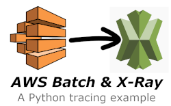

# What's inside?
This repository contains an example AWS Batch job that is pre-wired to support Xray Tracing.

# Components
There are several components that make this example work:

*   **[CloudFormation Template](BatchExample.yaml)**
    The CloudFormation template defines an AWS Batch Job Definition, Job Queue, Compute Environment, and a VPC infrastrucure upon which it can run.

*   **[Dockerfile](Dockerfile)**
    The Dockefile represents a container that is pushed to awscory/xraysample:latest.  This container includes the [example.py Python Script](example.py) that will run as the Batch Job.

# How it works

### Segment emmitance
The [example.py Python Script](example.py) implements the Python SDK for AWS X-Ray.  The implementation includes plugins for EC2 and ECS. Leveraging Python function decorators and manual segment creation, the script will emit **One Segment** with **Two SubSegments**.  The last SubSegment will contain an annotation, metadata, as well as a raised exception (to demonstrate exception capture).


### X-Ray Daemon
When the script emits segments, annotations, etc. to X-Ray, it does so by sending data to the local X-Ray daemon.  This daemon is installed into the Ec2 hosts underlying the AWS Batch compute environment via a launch template.  If you review the launch template in the [CloudFormation Template](BatchExample.yaml, you will note UserData instructions necessary to configure ECS and X-Ray components.

```
  UserData:  #Ideally this would be configurd via custom AMI so that proxy options could be set and installation of ecs agent,docker, and xray would not delay boot.
            Fn::Base64: |
              MIME-Version: 1.0
              Content-Type: multipart/mixed; boundary="==BOUNDARY=="

              --==BOUNDARY==
              MIME-Version: 1.0 

              #!/bin/bash
              amazon-linux-extras disable docker
              amazon-linux-extras install -y ecs
              /bin/systemctl enable --now --no-block ecs.service
              curl https://s3.dualstack.us-east-2.amazonaws.com/aws-xray-assets.us-east-2/xray-daemon/aws-xray-daemon-3.x.rpm -o /home/ec2-user/xray.rpm
              yum install -y /home/ec2-user/xray.rpm
              /bin/systemctl restart xray.service
              --==MYBOUNDARY==--
```

> Note: When used with AWS Batch, the UserData to bootstrap the compute environment instances must be a [multi-part mime type](https://docs.aws.amazon.com/batch/latest/userguide/launch-templates.html).  While this may be desirable in some cases, the same instructions could be used to package a custom AMI to support the environment as well.  This may be a more economical solution long-term.

The X-Ray daemon in this example is installed with the default configuration upon the compute environment instanace(s). It leverages the authorization provided by the IAM Instance Profile associated with the EC2 Instance(s).  When AWS Batch starts a Job, the Task supporting the job will be able to access the X-Ray daemon via local networking.

### X-Ray service communication
Once the X-Ray daemon is running on the EC2 Instances in the Compute Environment, it will periodically send batches of data to the AWS X-Ray service in the local AWS Region.

> Note: The destination region and elements controling the size of the batch and reporting velocity can be configured via the [Configuration File](https://docs.aws.amazon.com/xray/latest/devguide/xray-daemon-configuration.html#xray-daemon-configuration-configfile).  For the purposes of this demo, no customizations have been made.

# Running the Example
Once the CloudFormation template has been applied to an account, an AWS Batch Job can be started using the generated AWS Batch Job Definition and Compute Environment.  When starting a job, leave the "example.py" input as-is. This will run the sample file from this repo that is already present in the Docker image.

When the Job runs, an ECS Task will start upon the ECS Cluster hosting the Compute Environment Instance.  It will complete rather quickly as the example work is small. 

Once the job is complete, you will note a new X-Ray trace in the region.  This trace will contain the Segment, SubSegment, Annotation, Metadata, and Exception.

Vist the Traces portion of the X-Ray console to review the output.